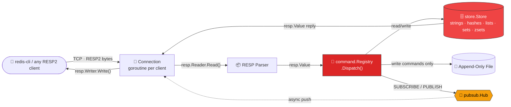
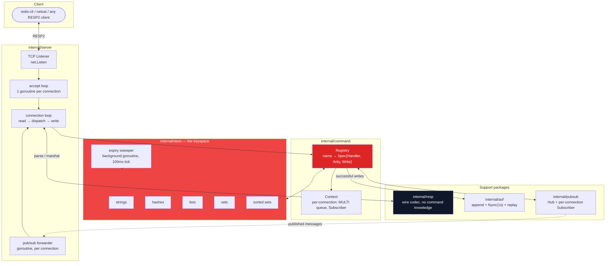
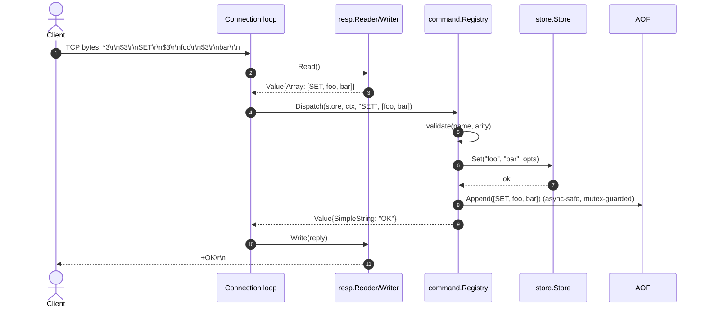
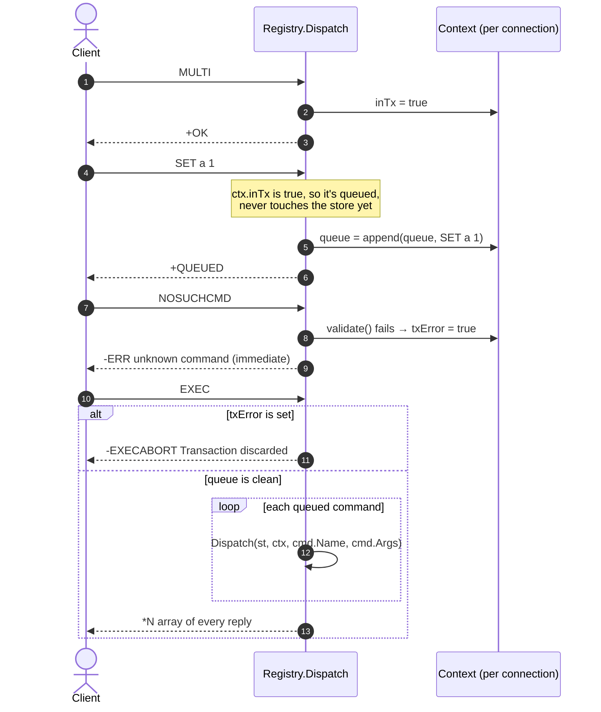
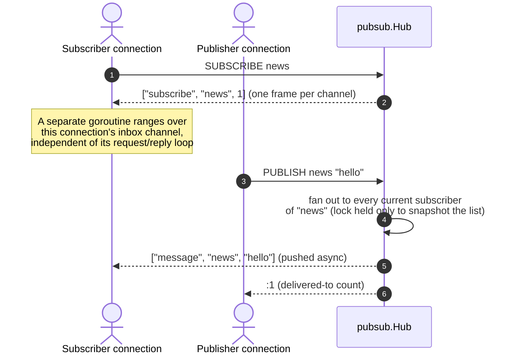
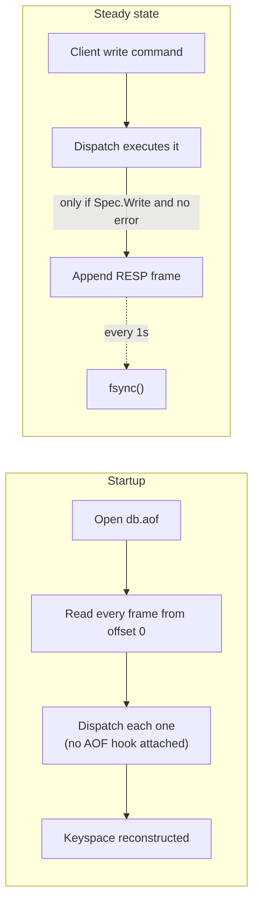

<div align="center">


[](https://git.io/typing-svg)

<br/>

[](https://go.dev)
[](https://github.com/ArnavBuild04/goredis-main/actions)
[](https://redis.io/docs/reference/protocol-spec/)
[](https://docker.com)
[](go.mod)

</div>

<br/>

> GoRedis is a Redis server implementation, not a Redis client. Point `redis-cli`, or any raw TCP
> socket, at it and it speaks RESP2 for real — strings, hashes, lists, sets, sorted sets, TTLs,
> `MULTI`/`EXEC` transactions, `SUBSCRIBE`/`PUBLISH`, and crash-safe append-only persistence. The
> point of building it wasn't to compete with Redis — it's that reading about a single-threaded
> event loop, a binary-safe wire protocol, or "everysec" fsync durability is not the same as
> having had to make each of those decisions yourself and defend it in code review.

<br/>

## Table of Contents

<table>
<tr><td width="50%" valign="top">

**Understanding the system**
- [60-Second Tour](#-60-second-tour)
- [System Architecture](#-system-architecture)
- [A Request, End to End](#-a-request-end-to-end)
- [Supported Data Types](#-supported-data-types)

</td><td width="50%" valign="top">

**Under the hood**
- [The Store Engine & Concurrency](#-the-store-engine--concurrency)
- [Transactions](#-transactions)
- [Pub/Sub](#-pubsub)
- [Persistence (AOF)](#-persistence-aof)

</td></tr>
<tr><td width="50%" valign="top">

**Reference**
- [Command Reference](#-command-reference)
- [Project Structure](#-project-structure)

</td><td width="50%" valign="top">

**Doing it yourself**
- [Getting Started](#-getting-started)
- [Testing Philosophy](#-testing-philosophy)
- [Design Decisions & Roadmap](#-design-decisions--roadmap)

</td></tr>
</table>

<br/>

## 🎯 60-Second Tour

A client opens a TCP connection and sends bytes shaped like `*3\r\n$3\r\nSET\r\n...` — the RESP2
wire format. GoRedis reads that stream, parses it into a typed `Value`, looks the command name up
in a registry, and runs it against an in-memory keyspace guarded by a single `sync.RWMutex`. If the
command mutated something, it's appended to an on-disk log before the reply goes back — so a
restart replays that log and the data is exactly where it was.



Every arrow above is a real package boundary, not just a diagram convenience — `internal/resp`
doesn't know commands exist, `internal/store` doesn't know RESP exists, and `internal/command` is
the only package that imports both. That separation is what makes the same `Registry.Dispatch`
call usable from a live connection **and** from AOF replay at startup, unchanged.

<br/>

## 🏢 System Architecture



**One process, no external services.** There's no database, no message broker, no cache in front
of a cache — the entire system is this Go binary plus an append-only file on local disk. That's a
deliberate scope choice, not a limitation nobody noticed: the interesting engineering here is the
protocol, the concurrency model, and the durability story, not distributed coordination.

<br/>

## 🔄 A Request, End to End



Two things worth noticing: the AOF append happens **inside** `Dispatch`, driven by the command's
`Spec.Write` flag — not bolted on in the connection loop — so a write executed from inside an
`EXEC` block gets logged exactly the same way a top-level write does, with no special-casing.
And the reply only goes out after the store mutation returns, so a client never sees `+OK` for a
write that didn't actually happen.

<br/>

## 📊 Supported Data Types

| Type | Backing structure | Why this shape | Commands |
|---|---|---|---|
| **String** | `string` | The base case — also backs counters (`INCR`) via string↔int parsing on each call, exactly like real Redis | `SET GET GETSET SETNX SETEX MSET MGET INCR INCRBY DECR DECRBY APPEND STRLEN` |
| **Hash** | `map[string]string` | Field access needs to be O(1); no ordering guarantee to preserve | `HSET HGET HGETALL HDEL HEXISTS HLEN HKEYS HVALS HMGET HINCRBY` |
| **List** | `[]string` | Simple and cache-friendly for small/medium lists; `LPUSH` is O(N) here — see [Design Decisions](#-design-decisions--roadmap) for the honest trade-off | `LPUSH RPUSH LPOP RPOP LLEN LRANGE LINDEX` |
| **Set** | `map[string]struct{}` | Membership is the only operation that matters; `struct{}` costs zero bytes per entry | `SADD SREM SMEMBERS SISMEMBER SCARD` |
| **Sorted Set** | `map[string]float64`, sorted on read | Real Redis uses a skip list for O(log N) range queries; this trades that for a plain map sorted on demand — see below | `ZADD ZSCORE ZREM ZCARD ZRANK ZRANGE` |

Every key also carries an optional expiry (`EXPIRE`, `PEXPIRE`, `TTL`, `PTTL`, `PERSIST`), and a
key touched by the wrong command type fails with `WRONGTYPE` — exactly like Redis — **except**
`SET`, which (also exactly like Redis) always overwrites regardless of what was there before.
That asymmetry is easy to get wrong; it's covered by `TestWrongType` and `TestSetNXXX` in
`internal/store/store_test.go`.

<br/>

## 🔧 The Store Engine & Concurrency

```go
// internal/store/store.go
type Store struct {
    mu   sync.RWMutex
    data map[string]*entry
    ...
}
```

One map, one `RWMutex`, guarding the entire keyspace. That's a global lock, not a per-key or
sharded one — a deliberate, stated trade-off:

- **Reads** (`GET`, `LRANGE`, `SMEMBERS`, ...) take `RLock()`, so they run concurrently with each
  other and block only actual writers.
- **Writes** take `Lock()` for the shortest span that keeps the operation atomic — e.g. `INCR`
  reads, parses, and writes the counter under one held lock, so two concurrent `INCR`s can never
  interleave and lose an update. `TestConcurrentIncr` (`-race`, 200 goroutines) asserts exactly
  this.
- **Expiry** is enforced twice: lazily on every read/write (`getLocked` checks `expireAt` before
  returning an entry) and by a background sweeper that scans the whole map every 100ms and evicts
  anything expired — so an idle key doesn't survive forever just because nothing happened to read
  it again.

A sharded lock (hash the key, pick 1-of-N mutexes) would scale better under write contention on
*different* keys — it's called out explicitly in the roadmap rather than pretended away, because
the honest answer to "why not shard it" is "the dataset sizes this targets don't need it yet," not
"it didn't occur to me."

<br/>

## 🔀 Transactions

`MULTI` / `EXEC` / `DISCARD`, implemented as per-connection state in `command.Context` — not a
separate subsystem:



The one Redis behavior worth calling out by name: a command that fails **validation** (unknown
name, wrong arity) while queuing marks the whole transaction dirty and `EXEC` refuses to run any
of it (`EXECABORT`) — but a command that's queued *validly* and fails **at runtime** (e.g. `INCR`
on a non-numeric string) does not abort the batch; its error just occupies that one slot in the
reply array, and every other queued command still runs. `TestMultiAbortsOnBadQueuedCommand` and
`TestMultiExecQueuesAndRuns` in `internal/command/command_test.go` pin both cases down.

What's **not** implemented: `WATCH` (optimistic locking / check-and-set across a transaction).
Without it, GoRedis's transactions guarantee atomicity and isolation from other clients' commands
interleaving mid-batch, but not "abort if a watched key changed before EXEC." Listed honestly in
the roadmap, not silently missing.

<br/>

## 📡 Pub/Sub



Two implementation choices worth defending:

1. **A published message can arrive at any time, not just between requests** — so each connection
   runs a second goroutine whose only job is to range over that connection's inbox channel and
   push `message` frames, while the main loop keeps handling requests. Both goroutines write to the
   same `net.Conn`, so a `sync.Mutex` around the socket write is what stops a pub/sub push and a
   command reply from interleaving mid-frame and corrupting the stream for the client.
2. **A slow subscriber never blocks a publisher.** `Hub.Publish` releases its lock before doing any
   I/O-shaped work, then sends to each subscriber's buffered channel with `select`+`default` —
   full inbox means the message is dropped for that one subscriber, not that `PUBLISH` blocks
   until they catch up. Real Redis eventually disconnects a subscriber that can't keep up for
   exactly this reason; dropping is the same trade-off in miniature.

<br/>

## 📜 Persistence (AOF)

Append-only file, not a point-in-time snapshot: every successful write command is marshaled back
into its own RESP wire format and appended to `db.aof`, fsynced once a second (Redis's own
`appendfsync everysec` default — bounding data loss on crash to about one second of writes without
paying an fsync on every single command). On startup, the file is replayed from byte zero through
the same `Registry.Dispatch` a live connection uses, with one difference: the replay `Context` has
no AOF hook wired up, so replaying the log doesn't re-append what it just read.



Two honest limitations, stated rather than hidden: a `MULTI`/`EXEC` block is logged as its
individual commands, not wrapped in its own `MULTI`/`EXEC` markers, so replay reproduces the net
effect of a transaction but not its original framing — fine for reconstructing state, not
sufficient if you needed to replay *only complete* transactions. And there's no background AOF
rewrite/compaction: the file only grows, the same starting point real Redis's own AOF had before
`BGREWRITEAOF` was added. Both are called out again in the roadmap.

<br/>

## 📖 Command Reference

<details>
<summary><b>All 62 commands, grouped by type (click to expand)</b></summary>

**Connection**
| Command | Syntax |
|---|---|
| `PING` | `PING [message]` |
| `ECHO` | `ECHO message` |

**Generic / keyspace**
| Command | Syntax |
|---|---|
| `DEL` | `DEL key [key ...]` |
| `EXISTS` | `EXISTS key [key ...]` |
| `EXPIRE` / `PEXPIRE` | `EXPIRE key seconds` / `PEXPIRE key ms` |
| `TTL` / `PTTL` | `TTL key` — seconds / ms remaining, `-1` no expiry, `-2` no key |
| `PERSIST` | `PERSIST key` |
| `TYPE` | `TYPE key` |
| `KEYS` | `KEYS pattern` (glob: `*`, `?`, `[...]`) |
| `RENAME` | `RENAME src dst` |

**Strings**
| Command | Syntax |
|---|---|
| `SET` | `SET key value [EX s \| PX ms] [NX \| XX]` |
| `GET` / `GETSET` | `GET key` / `GETSET key value` |
| `SETNX` / `SETEX` | `SETNX key value` / `SETEX key seconds value` |
| `MSET` / `MGET` | `MSET k v [k v ...]` / `MGET k [k ...]` |
| `INCR` / `INCRBY` / `DECR` / `DECRBY` | `INCRBY key delta` |
| `APPEND` / `STRLEN` | `APPEND key value` / `STRLEN key` |

**Hashes**
| Command | Syntax |
|---|---|
| `HSET` | `HSET key field value [field value ...]` |
| `HGET` / `HGETALL` / `HMGET` | `HGET key field` |
| `HDEL` | `HDEL key field [field ...]` |
| `HEXISTS` / `HLEN` | `HEXISTS key field` / `HLEN key` |
| `HKEYS` / `HVALS` | `HKEYS key` / `HVALS key` |
| `HINCRBY` | `HINCRBY key field delta` |

**Lists**
| Command | Syntax |
|---|---|
| `LPUSH` / `RPUSH` | `LPUSH key value [value ...]` |
| `LPOP` / `RPOP` | `LPOP key` |
| `LLEN` | `LLEN key` |
| `LRANGE` | `LRANGE key start stop` (negative indices count from the tail) |
| `LINDEX` | `LINDEX key index` |

**Sets**
| Command | Syntax |
|---|---|
| `SADD` / `SREM` | `SADD key member [member ...]` |
| `SMEMBERS` / `SCARD` | `SMEMBERS key` / `SCARD key` |
| `SISMEMBER` | `SISMEMBER key member` |

**Sorted sets**
| Command | Syntax |
|---|---|
| `ZADD` | `ZADD key score member [score member ...]` |
| `ZSCORE` / `ZRANK` | `ZSCORE key member` / `ZRANK key member` |
| `ZREM` / `ZCARD` | `ZREM key member [member ...]` / `ZCARD key` |
| `ZRANGE` | `ZRANGE key start stop [WITHSCORES]` |

**Transactions**
| Command | Syntax |
|---|---|
| `MULTI` / `EXEC` / `DISCARD` | see [Transactions](#-transactions) |

**Pub/Sub**
| Command | Syntax |
|---|---|
| `SUBSCRIBE` / `UNSUBSCRIBE` | `SUBSCRIBE channel [channel ...]` |
| `PUBLISH` | `PUBLISH channel message` |

**Server**
| Command | Syntax |
|---|---|
| `FLUSHALL` / `DBSIZE` | drop / count all keys |
| `INFO` | server + keyspace summary |

</details>

<br/>

## 📂 Project Structure

```
goredis-main/
├── cmd/goredis/main.go          entry point: flags, signal handling, wiring
├── internal/
│   ├── resp/                    RESP2 wire codec — Value, Reader, Writer
│   ├── store/                   the keyspace: strings, hashes, lists, sets, zsets, TTL
│   ├── pubsub/                  channel registry: Hub + per-connection Subscriber
│   ├── command/                 registry + one handler file per command category
│   ├── aof/                     append-only-file persistence: append, fsync, replay
│   └── server/                  TCP listener, per-connection loop, graceful shutdown
├── .github/workflows/ci.yml     gofmt, vet, build, test -race on every push
├── Dockerfile                   multi-stage build → distroless runtime image
├── Makefile                     build / run / test / docker targets
├── README.md                    you are here
└── INTERVIEW_READY.md           architecture theory + Q&A, beginner to advanced
```

Every `internal/` package is a one-way dependency: `resp` depends on nothing else in this module;
`store` depends only on the standard library; `pubsub` depends only on the standard library;
`command` depends on `resp`, `store`, and `pubsub`; `aof` depends only on `resp`; `server` is the
only package that imports all of the above. Nothing depends on `server` or `command` from below —
which is what makes every layer testable in isolation, and is why `internal/store/store_test.go`
and `internal/command/command_test.go` need no network, no goroutine choreography, and no test
doubles.

<br/>

## 🚀 Getting Started

<details open>
<summary><b>Run it locally</b></summary>

```bash
go run ./cmd/goredis --port 6379 --aof db.aof
```

Connect with `redis-cli` if you have it:

```bash
redis-cli -p 6379
127.0.0.1:6379> SET mykey "Hello, GoRedis!"
OK
127.0.0.1:6379> GET mykey
"Hello, GoRedis!"
127.0.0.1:6379> ZADD leaderboard 100 alice 250 bob
(integer) 2
127.0.0.1:6379> ZRANGE leaderboard 0 -1 WITHSCORES
1) "alice"
2) "100"
3) "bob"
4) "250"
```

No `redis-cli` handy? It's a real TCP server — raw RESP2 works from anything:

```bash
printf '*1\r\n$4\r\nPING\r\n' | nc localhost 6379
# +PONG
```

</details>

<details>
<summary><b>Docker</b></summary>

```bash
docker build -t goredis .
docker run -p 6379:6379 -v goredis-data:/data goredis
```

</details>

<details>
<summary><b>Makefile targets</b></summary>

```bash
make build       # go build → bin/goredis
make run         # build + run on :6379
make test        # go test ./...
make test-race   # go test -race ./...
make vet         # go vet ./...
make docker      # docker build
```

</details>

<br/>

## 🧪 Testing Philosophy

```bash
go test -race ./...
```

Every layer is tested at the boundary that actually matters for it, not through the network stack
above it:

- **`internal/resp`** — marshal/parse round-trip for every frame type, including edge cases
  (`null bulk`, `null array`, empty array) that are easy to get backwards.
- **`internal/store`** — direct calls against the engine: expiry timing, `WRONGTYPE` boundaries,
  `SET`'s NX/XX semantics, list/zset index clamping, and a 200-goroutine `-race` test on `INCR`
  that would fail immediately if the locking were wrong.
- **`internal/command`** — a harness that drives `Registry.Dispatch` directly (no sockets), so
  transaction abort semantics and pub/sub delivery are asserted against the actual reply values,
  not scraped off the wire.
- **`internal/aof`** — append, close, reopen, replay — including the specific regression case of
  appending *after* a replay and confirming the new write lands after the old data, not
  overwriting it.
- **`internal/server`** — the one layer that does go over real TCP: a minimal hand-rolled RESP
  client drives the actual accept loop, including a full process-restart-and-replay test and a
  live two-connection pub/sub round trip.

<br/>

## 🧭 Design Decisions & Roadmap

Stated trade-offs, not silent gaps — each one is a specific, defensible choice for what this
project is:

| Decision | What real Redis does instead | Why the simpler version, here |
|---|---|---|
| Sorted sets: `map[string]float64`, sorted on read | Skip list + hash table, O(log N) rank/range | O(N log N) per range call is fine at this scale, and the map is a fraction of the code — noted directly in `internal/store/zset.go` |
| Lists: `[]string`, `LPUSH` is O(N) | Doubly-linked list / quicklist, O(1) push either end | Simpler and more cache-friendly for small-to-medium lists; the O(N) cost is real and documented, not hidden |
| One global `RWMutex` for the whole keyspace | Single-threaded event loop (no lock needed at all) | Go's concurrency model makes goroutines-per-connection + one lock the idiomatic shape; sharding the lock is the obvious next step under write contention |
| `KEYS` pattern matching via `path.Match` | A bespoke glob matcher | Covers `*`, `?`, `[...]` — the common cases — without hand-rolling a matcher; diverges from Redis on `/` handling, called out in `internal/store/glob.go` |
| No `WATCH` / optimistic locking | Full check-and-set across `MULTI`/`EXEC` | `MULTI`/`EXEC` already gives atomicity and isolation; `WATCH` is the natural next command to add |
| AOF only, no RDB snapshots, no rewrite/compaction | RDB + AOF, with `BGREWRITEAOF` compaction | The log-replay durability story is the interesting part to build correctly first; compaction is a well-scoped follow-up |
| Single keyspace (no `SELECT`, no cluster mode) | 16 logical DBs, Cluster / Sentinel | Out of scope for a from-scratch protocol implementation — this project's point is the wire protocol and the engine, not distributed consensus |

**Next up, in rough priority order:** `WATCH` for optimistic transactions, `EXPIRE NX/XX/GT/LT`
flags, `RDB`-style snapshotting alongside the AOF, a sharded-lock store engine with a benchmark to
prove the win, and `LMOVE`/`LSET`/`SINTER`/`SUNION`/`SDIFF` to round out the list and set surfaces.

<br/>

<div align="center">


</div>
